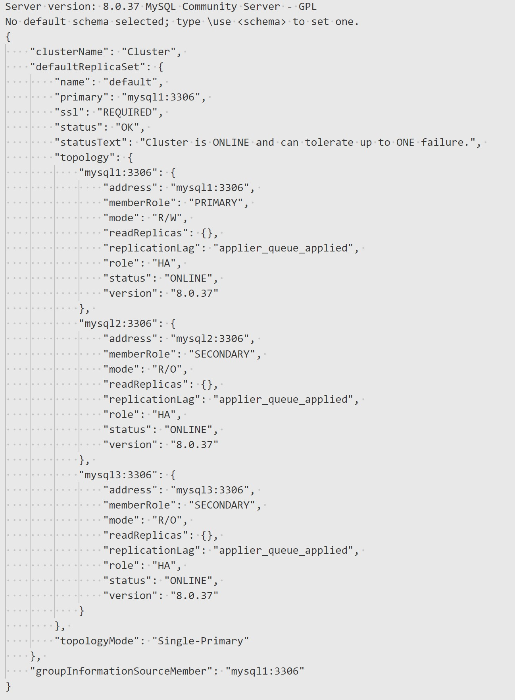

## Highly Available Deployment of mysql InnoDB Cluster in Docker Swarm and Kubernetes

This repository provides methods to deploy InnoDB Cluster in Docker Swarm and Kubernetes:

1. **InnoDB Cluster in Docker Swarm**:
2. **InnoDB Cluster in Kubernetes with Helm**:

---
### InnoDB Cluster in Docker Swarm

1. Use `docker-swarm` folder.
2. Copy the Docker Compose file to a node in your Docker Swarm cluster.
3. Run the following command:

    ```bash
    docker stack deploy -c 'docker-compose-swarm.yml' -d mysql
    ```

---
### InnoDB Cluster in Kubernetes with Helm

1. Add the InnoDB Cluster Helm repository:

    ```bash
    helm repo add mysql-operator https://mysql.github.io/mysql-operator/
    helm repo update
    ```

2. Install the InnoDB Cluster:

    ```bash
    helm upgrade --install mysql-operator mysql-operator/mysql-operator --namespace mysql-operator --create-namespace

    helm upgrade --install innodb-cluster mysql-operator/mysql-innodbcluster \
        --set credentials.root.user='innodb' \
        --set credentials.root.password='innodb' \
        --set serverInstances=3 \
        --set routerInstances=2 \
        --set tls.useSelfSigned=true \
        --set-string serverConfig.mycnf="[mysqld]\nmax_connections=4096" \
        --set version=8.0.37 \
        --set datadirVolumeClaimTemplate.resources.requests.storage=10Gi
    ```

---
